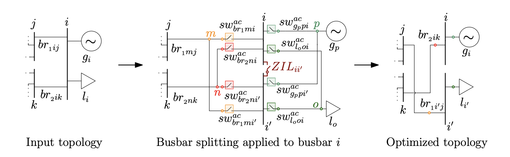

# PowerModelsTopologicalActions.jl 
 
[](https://github.com/Electa-Git/PowerModelsTopologicalActions.jl/actions/workflows/CI.yml)
[](https://electa-git.github.io/PowerModelsTopologicalActions.jl/dev/)
[](LICENSE)
[](https://doi.org/10.1016/j.segan.2026.102182)
 
A Julia/JuMP package for **steady-state grid topology optimization in AC and hybrid AC/DC grids**. It computes which lines to de-energize (Optimal Transmission Switching, OTS) and how to reconfigure selected substations (Busbar Splitting, BuS) to minimize total generation costs in the system, subject to the full physics of hybrid AC/DC grids.
 
Built on [PowerModels.jl](https://github.com/lanl-ansi/PowerModels.jl) and
[PowerModelsACDC.jl](https://github.com/Electa-Git/PowerModelsACDC.jl),
this is the first package able to perform both OTS and busbar splitting on **either part** of a hybrid AC/DC grid. While OTS and BuS have been used for decades in AC grids, they remain largely unexplored on the DC side. Long story short, with this package, one can optimize the grid topology with OTS and BuS, with a deep focus on BuS.

An intuition behind BuS process is represented in the following figure:



The model output is the status (1 closed, 0 open) of the busbar coupler and each switch, together with all the decision variables usually related to optimal power flow simulations.
 
## Capabilities
 
**Topological actions**
 
- AC / DC / combined AC-DC optimal transmission switching
- AC / DC / combined AC-DC busbar splitting
- Busbar splitting combined with OTS on selected busbars.

## Power Flow formulations

**Most refined**
- AC polar coordinates — exact, MINLP
- LPAC approximation (cold start) — MIQCP


**To be further refined**
- SOC relaxation — MISOCP
- QC relaxation — MIQCP
- DC approximation — MILP, partial support


## Installation
 
```julia
   ] add PowerModelsTopologicalActions
```
 
Requires Julia ≥ 1.10 and a solver appropriate to your formulation, e.g. MINLP formulation -> Juniper + Ipopt + a MIP solver for the exact MINLP, or Gurobi (recommended and supported)/Mosek/HiGHS for the LPAC approximation.
 
## Quick example
 
```julia
using PowerModels;                   const _PM     = PowerModels
using PowerModelsACDC;               const _PMACDC = PowerModelsACDC
using PowerModelsTopologicalActions; const _PMTP   = PowerModelsTopologicalActions
using JuMP, Ipopt, Gurobi, Juniper
 
gurobi  = JuMP.optimizer_with_attributes(Gurobi.Optimizer, "MIPGap" => 1e-4)
ipopt   = JuMP.optimizer_with_attributes(Ipopt.Optimizer, "tol" => 1e-6, "print_level" => 0)
juniper = JuMP.optimizer_with_attributes(Juniper.Optimizer,
              "nl_solver" => ipopt, "mip_solver" => gurobi)
 
s = Dict("output" => Dict("branch_flows" => true), "conv_losses_mp" => true)
 
data = _PM.parse_file("data_sources/case5_acdc.m")
_PMACDC.process_additional_data!(data)
 
# --- baseline ---
result_opf = _PMACDC.solve_acdcopf(data, ACPPowerModel, ipopt; setting = s)
  
# --- busbar splitting: prepare → solve → check ---
data_split, switch_couples, extremes = _PMTP.AC_busbars_split(data, 2)

result_bus = _PMTP.run_acdc_BuS_AC(data_split, LPACCPowerModel, gurobi)
 
data_fc = deepcopy(data_split)
_PMTP.prepare_AC_feasibility_check_AC_busbars(result_bus, data_split, data_fc, switch_couples, extremes, data)
result_fc = _PMACDC.solve_acdcopf(data_fc, ACPPowerModel, ipopt; setting = s)
 
println("baseline:  ", result_opf["objective"])   # 194.139 $/h
println("after BuS: ", result_fc["objective"])    # 186.349 $/h  → 4.0 % saving
```
 
Busbar splitting is organized in three stages: prepare the data, optimize and optionally verify the resulting topology is AC-feasible. 

## Documentation
 
Full documentation is in [`docs/`](docs/src):
 
| Page | Contents |
|---|---|
| [Installation](docs/src/installation.md) | Solver stacks, settings, bundled test cases |
| [Quick start](docs/src/quickstart.md) | BuS example on a 5-buses test case |
| [Optimal transmission switching](docs/src/ots.md) | OTS problem specifications and scaling |
| [Busbar splitting](docs/src/busbar_splitting.md) | The main contribution of this package |
| [AC feasibility check](docs/src/feasibility_check.md) | Validating relaxed and approximated topologies |
| [Formulations](docs/src/formulations.md) | Choosing between ACP, SOC, QC, LPAC, DC |
| [Data model](docs/src/data_model.md) | What the split functions do to your network dictionary |
| [API reference](docs/src/api.md) | Function-by-function listing |
| [Known issues and gotchas](docs/src/known_issues.md) | Known issues highlighted by Claude |
 
To build the HTML docs locally:
 
```console
$ julia --project=docs -e 'using Pkg; Pkg.develop(PackageSpec(path=pwd())); Pkg.instantiate()'
$ julia --project=docs docs/make.jl
```
 
## Running the tutorials -> still to be refined
 
 
## Status
 
Research code accompanying a peer-reviewed publication. The models are sound and validated
against the published results, but the package is still being developed to include functionalities described in further publications.
 
Contributions are welcome, particularly: 
- docstrings on the exported problem specifications
- configurable big-M values, currently hardcoded per formulation file
- an API for restricting the switchable element set
- N-1 security constraints
- an API visually plotting the results of the grid topology optimization models (switches status and substation topology)

## Citing
 
> G. Bastianel, M. Vanin, D. Van Hertem, H. Ergun, "Optimal transmission switching and
> busbar splitting in hybrid AC/DC grids", *Sustainable Energy, Grids and Networks*, vol. 46,
> 2026, 102182. [doi:10.1016/j.segan.2026.102182](https://doi.org/10.1016/j.segan.2026.102182)
 
```bibtex
@article{bastianel2026topological,
  title   = {Optimal transmission switching and busbar splitting in hybrid AC/DC grids},
  author  = {Bastianel, Giacomo and Vanin, Marta and Van Hertem, Dirk and Ergun, Hakan},
  journal = {Sustainable Energy, Grids and Networks},
  volume  = {46},
  pages   = {102182},
  year    = {2026},
  doi     = {10.1016/j.segan.2026.102182}
}
```
 
## Acknowledgements
 
Developed as part of WP1 of the [ETF DIRECTIONS project](https://etch.be/en/directions-design-protection-and-control-offshore-dc-power-grids-and-power-hubs), funded by the FOD Economie of the Belgian Government in which [Etch - Energy Transmission Competence Hub](https://etch.be/en) - [EnergyVille](https://energyville.be/en/) and [KU Leuven](https://www.kuleuven.be/kuleuven) collaborated with Elia Group to explore the future of electrical energy hubs.

Primary developer: 
Giacomo Bastianel ([@GiacomoBastianel](https://github.com/GiacomoBastianel)).

Contributors: 
Marta Vanin ([@MartaVanin](https://github.com/MartaVanin)) $\rightarrow$ conceptualization of the package
