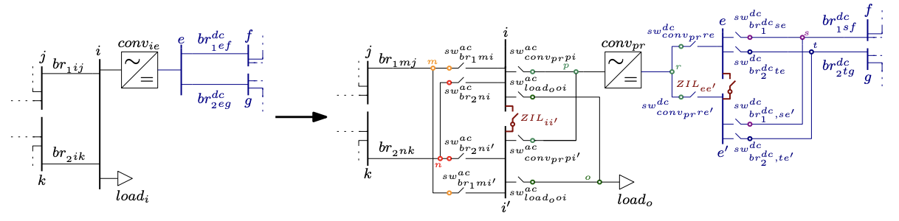
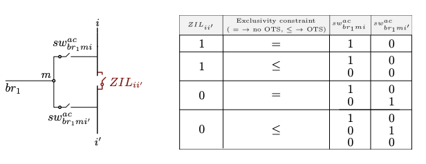

# Busbar splitting (main contribution of the package)

Busbar Splitting (BuS) can make electrically distant parts of a substation that are electrically close. A double-busbar substation whose coupler is closed behaves as a single electrical node. If the busbar coupler is open, the two parts become two distinct nodes that are physically adjacent but electrically distinct, with independent voltage magnitudes and angles. 
*In this formulation, every network element originally connected to the substation must then be connected to either one or the other part of the split busbar, or be disconnected in an OTS-fashion*.
This ideas is shown in the following figures for an AC substation:

![Representation of the proposed busbar splitting process for an AC busbar. The selected busbar `i` (left) is split into two buses `i` and `i'`, connected through a busbar coupler `ZIL_{ii'}`. The open/close position of this busbar coupler `ZIL_{ii'}` is represented in the optimization model by a binary variable. Each network element that was connected to busbar `i` in the input topology is linked to an auxiliary bus (named `m, n, o` and `p` in the figure) and can be connected to either one (`i`) or the other part (`i'`) of the split busbar through a switch (center).  Each switch is also represented in the model through a binary variable. After the optimization, the inactive switches are removed to yield the new topology (right).](../images/BuS_illustration_README.png)

and for both AC and DC substations:



The reconnection (or not) of the network elements is modelled through exclusivity constraint and summarized by the following figure:



`constraint_exclusivity_switch` is an "exclusivity" constraint including the switches connecting each grid element to the split busbar. It is either an equality ($=$ 1) or inequality ($\leq$ 1) constraint depending on whether OTS is performed or not \added{on the network elements originally connected to the split busbar}. If the network elements originally connected to the split busbar and BuS are both allowed in the same optimization  problem, `constraint_exclusivity_switch` is an inequality constraint and the switches are both allowed to be open. As a result, the grid element is not reconnected to the split busbar `i`. If `constraint_exclusivity_switch` is an equality constraint, each grid element decoupled from the original busbar `i` needs to be reconnected to one part of the split busbar, and one of the two switches must be closed. The possible switching states allowed by the "exclusivity" constraint are represented in the figure above, where 1 indicates that the switch is closed, $0$ that the switch is open. Note that constraint `constraint_ZIL_switch` imposes that if the busbar coupler is closed, i.e. BuS is not performed, one switch connecting the network element to the original busbar will always be closed.


## The three-stage workflow

BuS requires the network to be restructured before it can be optimized. There are three stages I have created in my models.

```
   ┌─────────────────────┐
   │                     │  AC_busbars_split / DC_busbars_split
   │   1. PREPARE DATA   │   → expands the network with auxiliary
   │                     │     buses and switches
   └──────────┬──────────┘
              │  data_split, switch_couples, extremes_ZIL
              ▼
   ┌─────────────────────┐
   │                     │   
   │    2. OPTIMIZE      │   run_acdc_BuS_AC / _DC / _AC_DC
   │                     │   → switch states as decision variables
   └──────────┬──────────┘
              │  result
              ▼
   ┌─────────────────────┐
   │                     │ 
   │  3. FEASIBILITY     │   prepare_AC_feasibility_check_*
   │        CHECK        │   then a plain AC/DC OPF
   │                     │   → verifies and prices the topology
   └─────────────────────┘
```

Stage 3 should be used even with each formulation as the switches are removed with the feasibility check, so one gets the exact OPF results with the optimized topology. More details about the feasibility check can be found here: [AC feasibility check](feasibility_check.md).

## Stage 1: preparing the network

```julia
data_split, switch_couples, extremes_ZIL = AC_busbars_split(data, bus_to_be_split)
data_split, dcswitch_couples, extremes_ZIL_dc = DC_busbars_split(data, busdc_to_be_split)
```

`bus_to_be_split` is either an `Int` (`bus_to_be_split` = x) or a vector of `Int`s (`bus_to_be_split` = [x, y, z]). Both functions `deepcopy` their
input, so the original network is left untouched.

For each busbar you nominate, the transformation:

1. duplicates the busbar into parts `i` and `i′`;
2. inserts a **busbar coupler** — a Zero Impedance Line (ZIL) modelled as a switch with `ZIL = true` — between them;
3. detaches every element attached to the busbar (generators, loads, branches, converters)
   and gives each its own **auxiliary bus**;
4. connects each auxiliary bus to *both* halves through a **pair of switches**, which constitute a `switch_couple`.

The optimizer then chooses, per element, which of its two switches is closed, plus whether
the coupler is open or closed. The total switch count is

```
n_switches = Σ_b (2 · n_b) + B
```

where `B` is the number of busbars being split and `n_b` the number of elements attached to
busbar `b`. This grows fast, and it is the reason splitting every busbar in a large network
is not computationally efficient, nor feasible.

See [Data model](data_model.md) for the resulting dictionary layout and the meaning of every key the transformation adds.

### The returned dictionary

All three elements matter, and two of them are needed again in stage 3.

- **`data_split`** — the expanded network. Pass this to the `run_acdc_BuS_*` functions.
- **`switch_couples`** — a dictionary of switch pairs. Each entry has `f_sw` and `t_sw`
  (the two switches connecting one element to the two busbar halves), `bus_split` (which
  original busbar), and `switch_split` (the index of that busbar's coupler). It is also
  stored on `data_split["switch_couples"]`, where the model reads it from.
- **`extremes_ZIL`** — maps each split busbar to the indices of its two parts.

### Variants

| Function | Use case |
|---|---|
| `AC_busbars_split` | AC busbar splitting in a hybrid AC/DC grid. |
| `DC_busbars_split` | DC busbar splitting in a hybrid AC/DC grid. |
| `AC_busbar_split_AC_grid` | AC-only networks with no DC components. Mutates its input. |
| `AC_busbars_split_ordered` | Preserves bus ordering. Mutates its input. |
| `AC_busbars_split_multiconductor` | Multiconductor / bipolar DC modelling, AC side. |
| `DC_busbars_split_multiconductor` | Multiconductor / bipolar DC modelling, DC side. |

Only `AC_busbars_split` and `DC_busbars_split` copy their input. The others mutate, so
`deepcopy` first if you need the original. **To be fixed soon**

## Stage 2: optimizing

```julia
run_acdc_BuS_AC(data_split, model_constructor, optimizer; kwargs...)
run_acdc_BuS_DC(data_split, model_constructor, optimizer; kwargs...)
run_acdc_BuS_AC_DC(data_split, model_constructor, optimizer; kwargs...)
```

Choose the function matching the preparation you performed. `run_acdc_BuS_AC_DC` requires a
network prepared by *both* `AC_busbars_split` and `DC_busbars_split`, applied in that order —

### The constraint set

For each switch, the model enforces:

| Constraint | Meaning |
|---|---|
| `constraint_switch_voltage_on_off_big_M` | when closed, the two buses share voltage magnitude and angle; when open, they are free |
| `constraint_switch_power_on_off` | active and reactive power through an open switch is zero |
| `constraint_switch_thermal_limit` | apparent power through a closed switch respects its rating |

For each switch couple:

| Constraint | Meaning |
|---|---|
| `constraint_exclusivity_switch` | `z_f + z_t ≤ 1` — an element connects to at most one half |
| `constraint_ZIL_switch` | if the coupler is closed (no split), elements stay on the original half |
| `constraint_BS_OTS_branch` | if neither switch closes, the element is disconnected and carries no power |

The exclusivity constraint is an inequality, not an equality, which is what allows an
element to be dropped entirely — busbar splitting with OTS on the affected elements. If you
want to forbid that and force every element back onto one half or the other, the
`constraint_exclusivity_switch_no_OTS` variant provides the equality form, though no
shipped problem specification uses it.

### The big-M reformulation

The natural way to state "these two buses have equal voltage when the switch is closed" is
bilinear:

```
z · θ_m = z · θ_i
z · U_m = z · U_i
```

which would make even the linear formulations non-convex. The package instead uses the
standard big-M form:

```
−(1 − z) · M_θ  ≤  θ_m − θ_i  ≤  (1 − z) · M_θ
−(1 − z) · M_U  ≤  U_m − U_i  ≤  (1 − z) · M_U
```

The constants are hardcoded per formulation file:

| Constant | Value | Applies to |
|---|---|---|
| `M_va` | `2π` | AC voltage angle difference |
| `M_vm` | `1.0` | AC voltage magnitude difference (p.u.) |
| `M_dc` | `1.0` | DC voltage magnitude difference (p.u.) |

These are deliberately conservative. Tightening them would strengthen the LP relaxation and
speed up branch-and-bound considerably; the reference paper flags optimal big-M selection
as future work and points to Pineda et al. (2024) for the methodology. If you are fighting
solve times on a large case, this is the highest-leverage thing to change, and it means
editing the constants in `src/formdcgrid/acp.jl`, `lpac.jl`, `shared.jl`, and `dcp.jl`.

### The objective

```
min  Σ_k c₁ₖ · Pᵍₖ  +  Σ_ZIL c_sw · (1 − z_sw)
```

Two things to note.

First, **only the linear generation cost coefficient is used**. `calc_gen_cost` reads
`g["cost"][end-1]`, so a quadratic term in your case data is silently ignored. This matches
the paper, which sets quadratic coefficients to zero.

Second, a **small penalty is charged for each open busbar coupler**. Auxiliary switches are
free (`cost = 0.0`); couplers cost `1.0` by default. This ensures the model only splits a
busbar when there is a real economic benefit, rather than splitting gratuitously among
equal-cost optima. If splitting never happens on a case where you expect it to, check
whether this penalty is swamping a small saving — you can adjust it per switch, depending also on the generator costs:

```julia
for (id, sw) in data_split["switch"]
    !haskey(sw, "auxiliary") && (sw["cost"] > 0.01)   # couplers only
end
```

## Stage 3: checking AC feasibility

Covered in full on the [AC feasibility check](feasibility_check.md) page. In brief:

```julia
data_fc = deepcopy(data_split)
prepare_AC_feasibility_check_AC_busbars(
    result, data_split, data_fc, switch_couples, extremes_ZIL, data_original)
result_fc = _PMACDC.solve_acdcopf(data_fc, ACPPowerModel, ipopt; setting = s)
```

## Reading the results [to be improved]

```julia
for (sw_id, sw) in result["solution"]["switch"]
    status     = sw["status"] < 0.1 ? "OPEN" : "closed"
    is_coupler = !haskey(data_split["switch"][sw_id], "auxiliary")
    println("switch $sw_id ($(is_coupler ? "coupler" : "element")): $status")
end
```

and/or

```julia
for sw_id in 1:length(data_bus["switch"])
    if !haskey(data_bus["switch"]["$sw_id"], "auxiliary") 
        println("switch $sw_id is a busbar coupler with status $(result_bus_lpac["solution"]["switch"]["$sw_id"]["status"])")
    else
        if result_bus_lpac["solution"]["switch"]["$sw_id"]["status"] > 0.9
            if data_bus["switch"]["$sw_id"]["t_bus"] == extremes_ZIL["$bus_to_split"][1]
                println("switch $sw_id, linked to element $(data_bus["switch"]["$sw_id"]["auxiliary"]) $(data_bus["switch"]["$sw_id"]["original"]) is connected to the original busbar $bus_to_split")
            else
                println("switch $sw_id, linked to element $(data_bus["switch"]["$sw_id"]["auxiliary"]) $(data_bus["switch"]["$sw_id"]["original"]) is connected to the second half of busbar $bus_to_split, which is $bus_to_split'")
            end
        end
    end
end
```

DC switches appear under `result["solution"]["dcswitch"]` with the same `status` key.

**A busbar was actually split if and only if its coupler is open.** Element switches being
open only tells you which side each element picked, or — if both switches of a couple are
open — that the element was dropped from the network entirely.


## Limitations

- Only **double-busbar** configurations are modelled. Breaker-and-a-half and double-bus
  double-breaker arrangements are not supported.
- All switching units are treated identically. Real substations distinguish circuit
  breakers, disconnectors, and load-break switches, each with different operating
  capabilities; the model gives them all the same treatment and the same thermal rating.
- Switch ratings default to `psw = qsw = thermal_rating = 100.0` p.u., which is effectively
  unlimited on the bundled cases. Override them on `data_split["switch"]` if you want them
  to bind.
- **No N-1 security constraints.** The optimized topology is not verified against
  contingencies. Given that splitting a busbar reduces redundancy, this is a material
  limitation for operational use and is listed as future work.
- **No stochastic RES modelling.** Single deterministic operating point only for now, but we have a paper modelling it: [](https://doi.org/10.1016/j.ijepes.2025.111527). The code will be added to this repository in the future.

